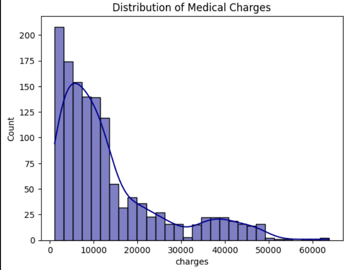
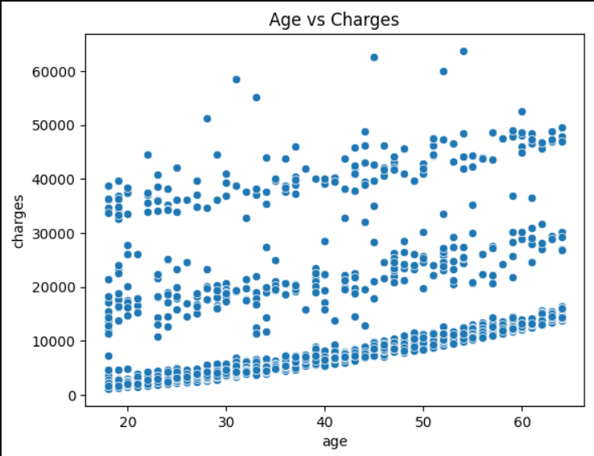
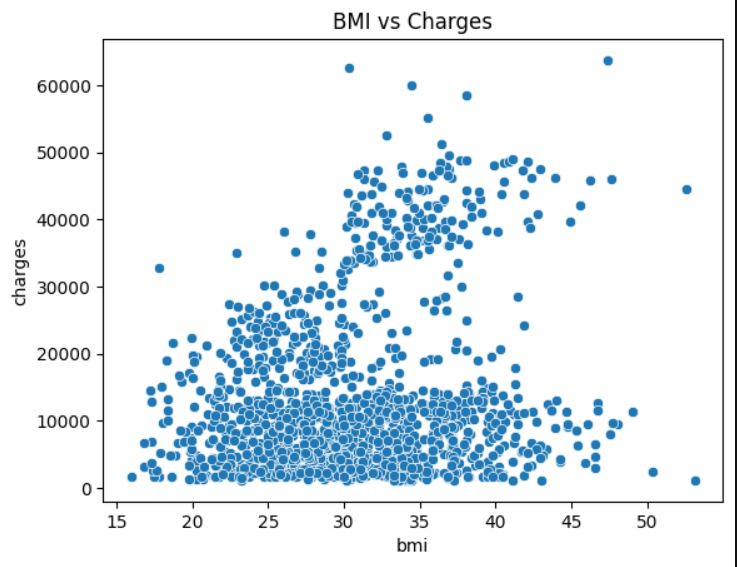
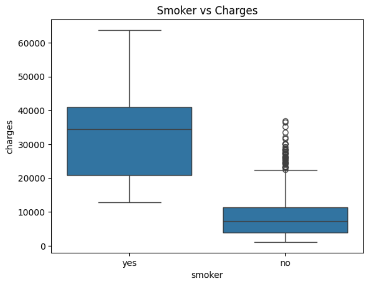

# 💰 Medical Cost Prediction

This project predicts patient medical costs based on demographic and lifestyle features such as age, BMI, smoking status, and region.  
Built as part of a Data Science portfolio project.

---

## 📌 Features
- **EDA**: Explored relationships between features and medical charges.
- **Models**: Linear Regression, Random Forest, and XGBoost.
- **Evaluation**: Compared R² and RMSE across models.
- **Feature Importance**: Identified smoking status and BMI as strong predictors.
- **Deployment**: Interactive Streamlit app for real-time predictions.

---

## 📊 Dataset
- Source: [Medical Cost Personal Dataset on Kaggle](https://www.kaggle.com/datasets/mirichoi0218/insurance)
- 1338 rows × 7 columns

---
## Visual Insights
### Distribution of medical charges


> **Insight**: It shows a right-skewed distribution, where the majority of medical charges are clustered towards the lower end.

### Age vs Charges

> **Insight**: medical charges tend to increase with age.

### BMI vs Charges

> **Insight**: There is a broad spread of charges at nearly every BMI level, with most individuals incurring charges below 15,000.


### Smokers vs Charges

> **Insight**:t is evident that smokers tend to incur significantly higher medical charges compared to non-smokers.


## 🚀 How to Run

### 1️⃣ Clone Repository
```bash
git clone https://github.com/Sawgat2/medical-cost-prediction.git
cd medical-cost-prediction


